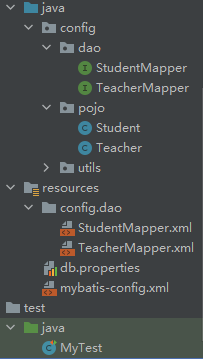

## 1-前置知识

`多对一`与`一对多`是一个相对关系

## 2-测试环境搭建

### 代码文件结构



### 2.1-创建SQL数据表

```mysql
CREATE TABLE `teacher` (
  `id` INT(10) NOT NULL,
  `name` VARCHAR(30) DEFAULT NULL,
  PRIMARY KEY (`id`)
) ENGINE=INNODB DEFAULT CHARSET=utf8;

INSERT INTO teacher(`id`, `name`) VALUES (1, '秦老师'); 

CREATE TABLE `student` (
  `id` INT(10) NOT NULL,
  `name` VARCHAR(30) DEFAULT NULL,
  `tid` INT(10) DEFAULT NULL,
  PRIMARY KEY (`id`),
  KEY `fktid` (`tid`),
  CONSTRAINT `fktid` FOREIGN KEY (`tid`) REFERENCES `teacher` (`id`)
) ENGINE=INNODB DEFAULT CHARSET=utf8;
INSERT INTO `student` (`id`, `name`, `tid`) VALUES (1, '小明', 1); 
INSERT INTO `student` (`id`, `name`, `tid`) VALUES (2, '小红', 1); 
INSERT INTO `student` (`id`, `name`, `tid`) VALUES (3, '小张', 1); 
INSERT INTO `student` (`id`, `name`, `tid`) VALUES (4, '小李', 1); 
INSERT INTO `student` (`id`, `name`, `tid`) VALUES (5, '小王', 1);
```

### 2.2-建立实体类

- Teacher

  ```java
  package config.pojo;
  
  import lombok.Data;
  
  @Data
  public class Teacher {
      private int id;
      private String name;
  }
  ```

- Student

  ```java
  package config.pojo;
  
  import lombok.Data;
  
  @Data
  public class Student {
      private int id;
      private String name;
  
      //学生需要关联一个老师
      private Teacher teacher;
  }
  ```

### 2.3-建立Mapper接口

- TeacherMapper.xml

  ```java
  package config.dao;
  
  import config.pojo.Teacher;
  import org.apache.ibatis.annotations.Param;
  import org.apache.ibatis.annotations.Select;
  
  public interface TeacherMapper {
  
      @Select("select * from teacher where id = #{tid}")
      Teacher getTeacher(@Param("tid") int id);
  }
  ```
  
- StudentMapper.xml

  ```java
  package config.dao;
  
  import config.pojo.Student;
  
  import java.util.List;
  
  public interface StudentMapper {
  
      //查询所有的学生信息，以及对应的老师信息
      public List<Student> getStudent();
      public List<Student> getStudent2();
  }
  ```

### 2.4-建立Mapper.xml文件

- TeacherMapper.xml

  ```xml
  <?xml version="1.0" encoding="UTF-8" ?>
  <!DOCTYPE mapper
          PUBLIC "-//mybatis.org//DTD Config 3.0//EN"
          "http://mybatis.org/dtd/mybatis-3-mapper.dtd">
  <mapper namespace="config.dao.TeacherMapper">
  
  </mapper>
  ```

- StudentMapper.xml

  ```xml
  <?xml version="1.0" encoding="UTF-8" ?>
  <!DOCTYPE mapper
          PUBLIC "-//mybatis.org//DTD Config 3.0//EN"
          "http://mybatis.org/dtd/mybatis-3-mapper.dtd">
  <mapper namespace="config.dao.StudentMapper">
      <select id="getStudent2" resultMap="StudentTeacher2">
          select s.id sid,s.name sname,t.name tname
          from student s,teacher t
          where s.tid = t.id
      </select>
  
  
      <resultMap id="StudentTeacher2" type="config.pojo.Student">
          <result property="id" column="sid"></result>
          <result property="name" column="sname"></result>
          <association property="teacher" javaType="config.pojo.Teacher">
              <result property="name" column="tname"></result>
          </association>
      </resultMap>
  
  
      <select id="getStudent" resultMap="StudentTeacher">
          select *
          from student
      </select>
  
      <resultMap id="StudentTeacher" type="config.pojo.Student">
          <result property="id" column="id"></result>
          <result property="name" column="name"></result>
          <association property="teacher" column="tid" javaType="config.pojo.Teacher" select="getTeacher"></association>
      </resultMap>
  
  
      <select id="getTeacher" resultType="config.pojo.Teacher">
          select *
          from teacher
          where id = #{id}
      </select>
  </mapper>
  ```

### 2.5-绑定注册

在`核心配置文件`中绑定注册`mapper接口(class)`或者`xml文件(resource)`

```xml
<mappers>
    <mapper resource="config/dao/TeacherMapper.xml"></mapper>
    <mapper resource="config/dao/StudentMapper.xml"></mapper>
</mappers>
```

### 2.6-测试查询

```java
public static void main(String[] args) {
    SqlSession sqlSession = MybatisUtils.getSqlSession();
    TeacherMapper mapper = sqlSession.getMapper(TeacherMapper.class);
    Teacher teacher = mapper.getTeacher(1);
    System.out.println(teacher);

    sqlSession.close();
}
@Test
public void testStudent(){
    SqlSession sqlSession = MybatisUtils.getSqlSession();
    StudentMapper mapper = sqlSession.getMapper(StudentMapper.class);
    List<Student> studentList = mapper.getStudent();
    for (Student student : studentList) {
        System.out.println(student);
    }

    sqlSession.close();
}
@Test
public void testStudent2(){
    SqlSession sqlSession = MybatisUtils.getSqlSession();
    StudentMapper mapper = sqlSession.getMapper(StudentMapper.class);
    List<Student> studentList = mapper.getStudent2();
    for (Student student : studentList) {
        System.out.println(student);
    }
    sqlSession.close();
}
```

## 3-代码分析

### 3.1-main

建立`TeacherMapper`接口，在`核心配置文件`中找到注册的`TeacherMapper`，进入对应`xml文件`或`mapper接口`，找到对应的`方法`和`sql`语句，执行语句

### 3.2-testStudent

#### 3.2.1-getStudent

建立`StudentMapper`接口，在`核心配置文件`中找到注册的`StudentMapper`，进入对应`xml文件`或`mapper接口`，找到对应的`方法`和`sql`语句，执行语句

这种方法是进行子查询

由于`student`这个表中的属性为：`id`，`name`，`tid`，但`Student`这个类中的字段属性为：`id`，`name`，`teacher`，字段不能一一对应。若是通过类似`Teacher`中的方法`select * from student`，`id`与`name`能正常查询，但`teacher`字段就不能找到，此时就需要在对应的`mapper.xml`中，设置`resultMap`，其中`teacher`字段是一个`java实体类`，所以需要利用`<association>`属性来映射，`property`和`column`属性与`<result>`标签一致，因为是实体类，所以还需要用`javaType`属性来映射，表示该查询出来的结果为一个实体类，最后通过`select`属性去查找，`select`属性为一种方法，其属性是同文件中的`sql语句的id`。

`<association>`标签的意思是：需要查找的属性`property:teacher`是一个实体类，对应的`java`类是`javaType`标记的实体类，其对应数据库中的属性列`tid`，这个`tid`需要通过`select`标记的方法查询。即：查找`teacher`这个属性，需要将`tid`传入`select`标记的方法`getTeacher`中进行查找，最后返回`Teacher`实体类

#### 3.2.2-getStudent2

建立`StudentMapper`接口，在`核心配置文件`中找到注册的`StudentMapper`，进入对应`xml文件`或`mapper接口`，找到对应的`方法`和`sql`语句，执行语句

这种方法是按照结果查询

sql语句为在两个表中查询，采用映射，进入`StudentTeacher2`，`teacher`属性需要通过`<association>`标记其为`java类`，其中的name为`tname`
