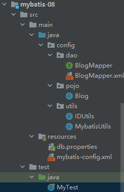
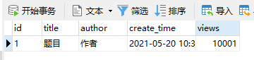
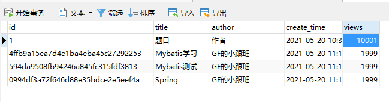
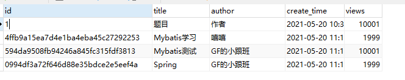
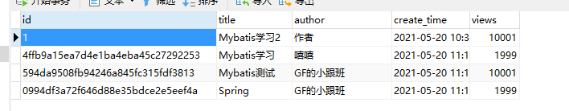

## 1-前置知识

动态SQL：根据不同的条件生成不同的SQL语句

动态SQL元素和JSTL或基于类似XML文本处理器相似

- if
- choose（when，otherwise）
- trim（where，set）
- foreach

## 2-搭建环境

### 2.1-java项目文件结构



### 2.2-建立数据库表

```mysql
CREATE TABLE `blog`(
    `id` VARCHAR(50) NOT NULL COMMENT '博客id',
    `title` VARCHAR(100) NOT NULL COMMENT '博客标题',
    `author` VARCHAR(30) NOT NULL COMMENT '博客作者',
    `create_time` DATETIME NOT NULL COMMENT '创建时间',
    `views` INT(30) NOT NULL COMMENT '浏览量'
)ENGINE=INNODB DEFAULT CHARSET=utf8
```

创建数据



### 2.3-编写实体类

```java
package config.pojo;

import lombok.Data;

import java.util.Date;

@Data
public class Blog {
    private String id;
    private String title;
    private String author;
    private Date createTime; //属性名和字段名不一致
    private int views;
}
```

### 2.4-编写接口

```java
package config.dao;

import config.pojo.Blog;

public interface BlogMapper {
    int addBlog(Blog blog);
}
```

### 2.5-编写mapper

```xml
<?xml version="1.0" encoding="UTF-8" ?>
<!DOCTYPE mapper
        PUBLIC "-//mybatis.org//DTD Config 3.0//EN"
        "http://mybatis.org/dtd/mybatis-3-mapper.dtd">
<mapper namespace="config.dao.BlogMapper">

    <insert id="addBlog" parameterType="config.pojo.Blog">
        insert into mybatis.blog (id, title, author, create_time, views)
            value (#{id},#{title},#{author},#{createTime},#{views})
    </insert>
</mapper>
```

### 2.6-编写工具类IDUtils

```java
package config.utils;

import java.util.UUID;

public class IDUtils {
    public static String getId(){
        return UUID.randomUUID().toString().replace("-","");
    }

}
```

### 2.7-修改mybatis-config.xml

添加`setting`

```xml
<settings>
    ......
    <setting name="mapUnderscoreToCamelCase" value="true"/>
</settings>
```

### 2.8-编写测试类

```java
import config.dao.BlogMapper;
import config.pojo.Blog;
import config.utils.IDUtils;
import config.utils.MybatisUtils;
import org.apache.ibatis.session.SqlSession;
import org.junit.Test;

import java.util.Date;

public class MyTest {
    @Test
    public void insertBlog(){
        SqlSession sqlSession = MybatisUtils.getSqlSession();
        BlogMapper mapper = sqlSession.getMapper(BlogMapper.class);
        Blog blog =new Blog();
        blog.setId(IDUtils.getId());
        blog.setTitle("Mybatis学习");
        blog.setAuthor("GF的小跟班");
        blog.setCreateTime(new Date());
        blog.setViews(1999);
        mapper.addBlog(blog);

        blog.setId(IDUtils.getId());
        blog.setTitle("Mybatis测试");
        mapper.addBlog(blog);

        blog.setId(IDUtils.getId());
        blog.setTitle("Spring");
        mapper.addBlog(blog);

        sqlSession.close();
    }
}
```

## 3-得到结果



## 4-需求

### 4.1-if

#### 4.1.1-接口

```java
List<Blog> queryBlogIf(Map map);
```

#### 4.1.2-mapper

```xml
<select id="queryBlogIf" parameterType="map" resultType="config.pojo.Blog">
    select * from mybatis.blog
    <where>
        <if test="title != null">
            title = #{title}
        </if>
        <if test="author != null">
            and author = #{author}
        </if>
    </where>
</select>
```

#### 4.1.3-测试类

```java
@Test
public void queryBlogIf(){
    SqlSession sqlSession = MybatisUtils.getSqlSession();
    BlogMapper mapper = sqlSession.getMapper(BlogMapper.class);

    HashMap map = new HashMap();
    map.put("title","Mybatis学习");
    map.put("author","GF的小跟班");
    List<Blog> blogList = mapper.queryBlogIf(map);
    for(Blog blog : blogList){
        System.out.println(blog);
    }
    sqlSession.close();
}
```

#### 4.1.4-分析

在`mapper`中`sql`语句中建立`if`标签，`test`属性为条件，构成条件，如果`title`或`author`不为空，就添加条件

### 4.2-choose，when，otherwise

#### 4.2.1-接口

```java
List<Blog> queryBlogChoose(Map map);
```

#### 4.2.2-mapper

```xml
<select id="queryBlogChoose" parameterType="map" resultType="config.pojo.Blog">
    select * from mybatis.blog
    <where>
        <choose>
            <when test="title != null">
                title = #{title}
            </when>
            <when test="author !=null">
                and author = #{author}
            </when>
            <otherwise>
                and views = #{views}
            </otherwise>
        </choose>

    </where>
</select>
```

#### 4.2.3-测试类

```java
@Test
public void queryBlogChoose(){
    SqlSession sqlSession = MybatisUtils.getSqlSession();
    BlogMapper mapper = sqlSession.getMapper(BlogMapper.class);

    HashMap map = new HashMap();
    map.put("author","GF的小跟班");
    map.put("views",1999);
    List<Blog> blogList = mapper.queryBlogChoose(map);
    for(Blog blog : blogList){
        System.out.println(blog);
    }
    sqlSession.close();
}
```

#### 4.2.4-分析

`Mybatis`提供了`choose`元素，类似`java`中的`switch`语句，进入第`x`条，后续都执行

### 4.3-where，set

#### 4.3.1-接口

```java
int updateBlog(Map map);
```

#### 4.3.2-mapper

```xml
<update id="updateBlog" parameterType="map">
    update mybatis.blog
    <set>
        <if test="title != null">
            title = #{title},
        </if>
        <if test="author != null">
            author = #{author},
        </if>
    </set>
    where id = #{id}
</update>
```

#### 4.3.3-测试类

```java
@Test
public void updateBlog(){
    SqlSession sqlSession = MybatisUtils.getSqlSession();
    BlogMapper mapper = sqlSession.getMapper(BlogMapper.class);

    HashMap map = new HashMap();
    map.put("title","Mybatis学习2");
    // map.put("views",1999);
    map.put("id","1");

    mapper.updateBlog(map);
    sqlSession.close();
}
```

#### 4.3.4-分析

`set`会自动删去多余的`,`，所以在每个set里的语句后都跟上`,`

`set`会动态前置`SET`关键字，所以`set`语句中必须满足一个条件

原数据



执行代码后的数据



### 4.4-trim

自定义

### 4.5-foreach

```xml
<foreach item="" index="" collection="" open="(" separator="," close=")">
    #{item}
</foreach>
```

指定一个集合`collection`，生命可以在元素体内使用的集合项`itme`和索引`index`，允许指定开头`open`和结尾字符串`close`以及在迭代结果之间放置分隔符`separator`

> 示例

```xml
select * from user where 1 = 1 and (id=1 or id=2 or id=3)

select * from user
<where>
    <foreach item="id" index="index" collection="ids"
        	 open="and (" separator="or" close=")">
    	#{id}
	</foreach>
</where>

```

在用到`map`时，只需要`map.put("ids",ArrayList<Integer>())`

## 5-SQL片段

有些时候，将一些功能部分抽取出来，方便复用

1. 使用SQL标签抽取公共不放呢

   ```xml
   <sql id="if-title-author">
   	<if test="title != null">
       	title = #{title}
       </if>
       <if test="author != null">
       	and author = #{author}
       </if>
   </sql>
   ```

2. 在需要使用的地方使用`include`标签，其中的`refid`引用对应的`sql`的`id`

   

