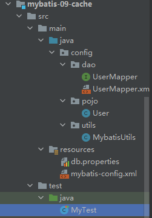
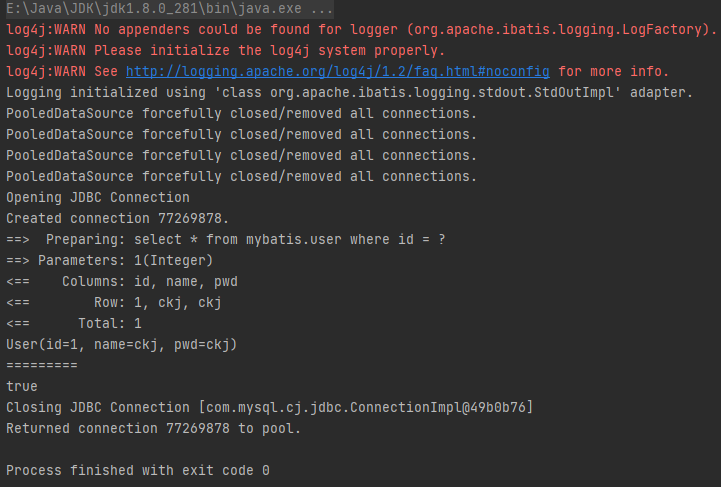
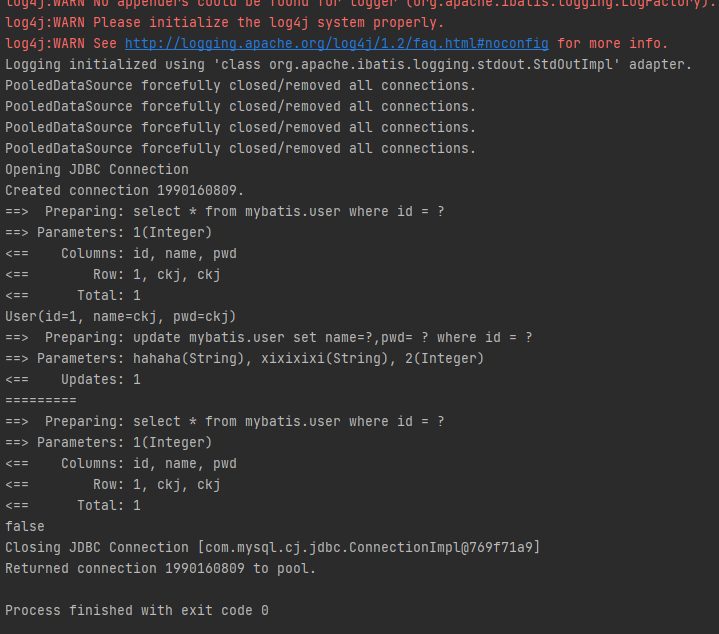
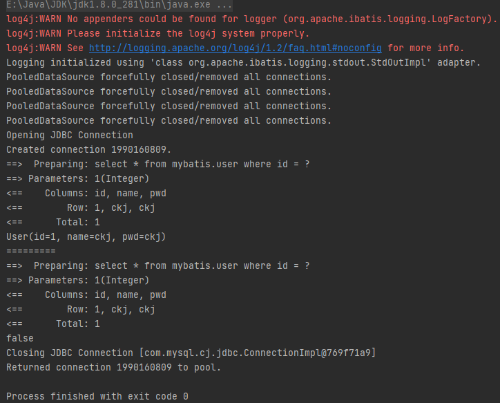
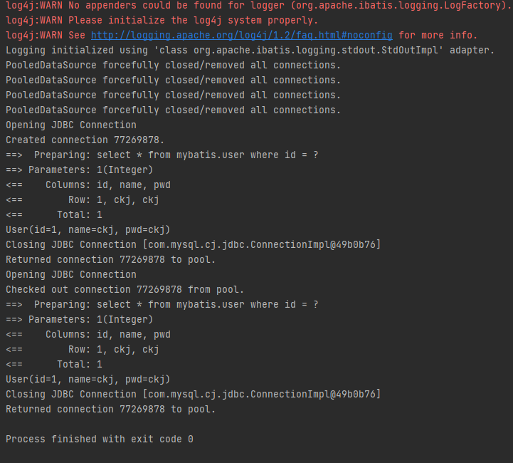
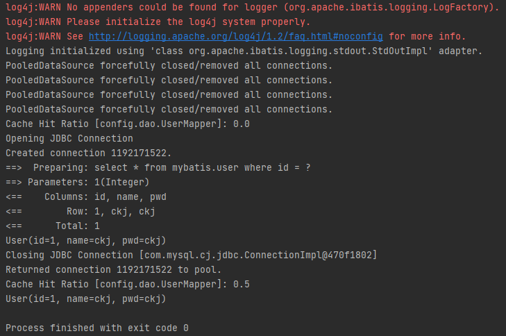
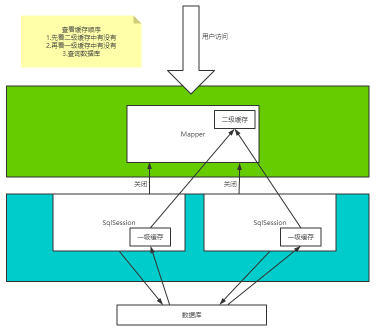

## 1-前置知识

### 1.1-缓存

- 存在内存中的临时数据
- 将用户经常查询的数据放在缓存中，用户去查询数据就不用从磁盘上（关系型数据库数据文件）查询，从缓存中查询，从而提高查询效率，解决高并发系统的性能问题

### 1.2-使用缓存的原因

- 减少和数据库的交互次数，减少系统开销，提高系统效率

### 1.3-应该使用缓存的数据

- 经常查询并且不经常改变的数据

## 2-Mybatis缓存

- Mybatis包含一个非常强大的缓存特性，可以非常方便地定制和配置缓存，缓存可以极大的提升查询效率
- Mybatis系统中默认定义了两级缓存：一次缓存、二级缓存
  - 默认情况下，只有一级缓存开启——`SqlSession`级别的缓存，也称为本地缓存
  - 二级缓存需要手动开启和配置，是基于`namespace`级别的缓存
  - 为了提高扩展性，`mybatis`定义了缓存接口`Cache`，可以通过实现`Cache`接口自定义二级缓存

## 3-一级缓存

`SqlSession`级别的缓存，也称为本地缓存，默认开启，无法关闭，只在同个`SqlSession`中有效

一次缓存其实是一个`Map`

### 3.1-测试

#### 3.1.1-文件结构



#### 3.1.2-接口

```java
User queryUserById(@Param("id") int id);
```

#### 3.1.3-xml

```xml
<?xml version="1.0" encoding="UTF-8" ?>
<!DOCTYPE mapper
        PUBLIC "-//mybatis.org//DTD Config 3.0//EN"
        "http://mybatis.org/dtd/mybatis-3-mapper.dtd">
<mapper namespace="config.dao.UserMapper">
    <select id="queryUserById" resultType="config.pojo.User">
        select * from mybatis.user where id = #{id}
    </select>
</mapper>
```

#### 3.1.4-测试类

```java
import config.dao.UserMapper;
import config.pojo.User;
import config.utils.MybatisUtils;
import org.apache.ibatis.session.SqlSession;
import org.junit.Test;

public class MyTest {

    @Test
    public void test() {
        //开始
        SqlSession sqlSession = MybatisUtils.getSqlSession();
        UserMapper mapper = sqlSession.getMapper(UserMapper.class);

        User user1 = mapper.queryUserById(1);
        System.out.println(user1);

        System.out.println("=========");
        User user2 = mapper.queryUserById(1);

        System.out.println(user1 == user2);

        sqlSession.close();
        //结尾
    }
}
```

> 其余代码与之前的文件相同

#### 3.1.5-测试结果



在SqlSession中执行，执行两次查询相同的记录，只进行了一次sql查询

#### 3.1.6-缓存知识

- 映射语句文件中的所有select语句的结果将会被缓存
- 映射语句文件中所有insert、update和delete语句会刷新缓存
- 缓存会使用最近最少算法（LRU）来清楚不需要的缓存
- 缓存不会定时刷新，没有刷新时间
- 缓存会保存列表或对象的1024个引用
- 缓存会被视为读/写缓存，这意味着获取收到的对象不是共享的，可以安全地被调用者修改，而不干扰其他调用者或线程所做的潜在修改

#### 3.1.7-缓存失效的情况

1. 查询不同的东西

2. 增删改操作

   ```java
   @Test
   public void test() {
       //开始
       SqlSession sqlSession = MybatisUtils.getSqlSession();
       UserMapper mapper = sqlSession.getMapper(UserMapper.class);
   
       User user1 = mapper.queryUserById(1);
       System.out.println(user1);
   
       mapper.updateUser(new User(2,"hahaha","xixixixi"));
   
       System.out.println("=========");
       User user2 = mapper.queryUserById(1);
   
       System.out.println(user1 == user2);
   
       sqlSession.close();
       //结尾
   }
   ```

   

3. 查询不同的Mapper.xml

4. 手动清理缓存

   ```java
   @Test
   public void test() {
       //开始
       SqlSession sqlSession = MybatisUtils.getSqlSession();
       UserMapper mapper = sqlSession.getMapper(UserMapper.class);
   
       User user1 = mapper.queryUserById(1);
       System.out.println(user1);
   
       sqlSession.clearCache();
       System.out.println("=========");
       User user2 = mapper.queryUserById(1);
   
       System.out.println(user1 == user2);
   
       sqlSession.close();
       //结尾
   }
   ```

   

## 4-二级缓存

### 4.1-基础知识

- 二级缓存也称为全局缓存，一次缓存作用域太低
- 基于`namespace`级别的缓存，一个名称空间，对应一个二级缓存
- 工作机制
  - 一个会话查询一条数据，这个数据就会被放在当前会话的一级缓存中
  - 如果当前会话关闭了，这个会话的一次缓存就没了；但我们想要的是，会话关闭了，一级缓存中的数据被保存到二级缓存中
  - 新的会话查询信息，就可以从二级缓存中获取内容
  - 不同的`mapper`查处的数据会放在自己对应的缓存中

### 4.2-开启二级缓存的方法

1. 显式地全局开启二级缓存，在`settings`中增加配置（默认是开启的）

   ```xml
   <setting name="cacheEnabled" value="true"/>
   ```

2. 在对应的`mapper.xml`文件中加入一行代码

   ```xml
   <cache />
   ```

3. 自定义参数

   ```xml
   <cache eviction="FIFO"
          flushInterval="60000"
          size="512"
          readOnly="true">
   </cache>
   ```

### 4.3-测试

```java
@Test
public void test() {
    SqlSession sqlSession = MybatisUtils.getSqlSession();
    UserMapper mapper = sqlSession.getMapper(UserMapper.class);
    User user1 = mapper.queryUserById(1);
    System.out.println(user1);
    sqlSession.close();

    SqlSession sqlSession2 = MybatisUtils.getSqlSession();
    UserMapper mapper2 = sqlSession2.getMapper(UserMapper.class);
    User user2 = mapper2.queryUserById(1);
    System.out.println(user2);
    sqlSession2.close();
}
```

按照以上代码，由于通过两个`sqlSession`去查找`Id = 1`的`user`，应当执行两次`sql`



此时，开启二级缓存，在`UserMapper.xml`中添加`<cache />`

```xml
<?xml version="1.0" encoding="UTF-8" ?>
<!DOCTYPE mapper
        PUBLIC "-//mybatis.org//DTD Config 3.0//EN"
        "http://mybatis.org/dtd/mybatis-3-mapper.dtd">
<mapper namespace="config.dao.UserMapper">
    <cache></cache>
    <select id="queryUserById" resultType="config.pojo.User">
        select * from mybatis.user where id = #{id}
    </select>
</mapper>
```

此时，只查询了一次`sql`



### 4.4-可能出现问题

- 需要实体类序列化`Cause: java.io.NotSerializableException`

## 5-缓存原理



## 6-自定义缓存ehcache

`EhCache`是一个纯`Java`的进程内缓存框架，只有快速、精干等特点，是`Hibernate`中默认的`CacheProvider`

### 6.1-使用步骤

#### 6.1.1-导入pom

```xml
<!-- https://mvnrepository.com/artifact/org.mybatis.caches/mybatis-ehcache -->
<dependency>
    <groupId>org.mybatis.caches</groupId>
    <artifactId>mybatis-ehcache</artifactId>
    <version>1.1.0</version>
</dependency>
```

#### 6.1.2-自定义使用缓存

在`mapper`文件中的`cache`标签内，使用`type`属性，标记使用的`cache`

```xml
<cache type="org.mybatis.caches.ehcache.EhcacheCache">
```

#### 6.1.3-添加配置文件

`ehcache.xml`

```xml
<?xml version="1.0" encoding="UTF-8"?>
<ehcache xmlns:xsi="http://www.w3.org/2001/XMLSchema-instance"
         xsi:noNamespaceSchemaLocation="http://ehcache.org/ehcache.xsd"
         updateCheck="false">
    <!--
        diskStore：为缓存路径，ehcache分为内存和磁盘两级，此属性定义磁盘的缓存位置。参数解释如下：
        user.home – 用户主目录
        user.dir  – 用户当前工作目录
        java.io.tmpdir – 默认临时文件路径
    -->
    <diskStore path="./tmpdir/Tmp_EhCache"/>
    <defaultCache
            eternal="false"
            maxElementsInMemory="10000"
            overflowToDisk="false"
            diskPersistent="false"
            timeToIdleSeconds="1800"
            timeToLiveSeconds="259200"
            memoryStoreEvictionPolicy="LRU"/>

    <cache
            name="cloud_user"
            eternal="false"
            maxElementsInMemory="5000"
            overflowToDisk="false"
            diskPersistent="false"
            timeToIdleSeconds="1800"
            timeToLiveSeconds="1800"
            memoryStoreEvictionPolicy="LRU"/>
    <!--
        defaultCache：默认缓存策略，当ehcache找不到定义的缓存时，则使用这个缓存策略。只能定义一个。
     -->
    <!--
        name:缓存名称。
        maxElementsInMemory:缓存最大数目
        maxElementsOnDisk：硬盘最大缓存个数。
        eternal:对象是否永久有效，一但设置了，timeout将不起作用。
        overflowToDisk:是否保存到磁盘，当系统当机时
        timeToIdleSeconds:设置对象在失效前的允许闲置时间（单位：秒）。仅当eternal=false对象不是永久有效时使用，可选属性，默认值是0，也就是可闲置时间无穷大。
        timeToLiveSeconds:设置对象在失效前允许存活时间（单位：秒）。最大时间介于创建时间和失效时间之间。仅当eternal=false对象不是永久有效时使用，默认是0.，也就是对象存活时间无穷大。
        diskPersistent：是否缓存虚拟机重启期数据 Whether the disk store persists between restarts of the Virtual Machine. The default value is false.
        diskSpoolBufferSizeMB：这个参数设置DiskStore（磁盘缓存）的缓存区大小。默认是30MB。每个Cache都应该有自己的一个缓冲区。
        diskExpiryThreadIntervalSeconds：磁盘失效线程运行时间间隔，默认是120秒。
        memoryStoreEvictionPolicy：当达到maxElementsInMemory限制时，Ehcache将会根据指定的策略去清理内存。默认策略是LRU（最近最少使用）。你可以设置为FIFO（先进先出）或是LFU（较少使用）。
        clearOnFlush：内存数量最大时是否清除。
        memoryStoreEvictionPolicy:可选策略有：LRU（最近最少使用，默认策略）、FIFO（先进先出）、LFU（最少访问次数）。
        FIFO，first in first out，这个是大家最熟的，先进先出。
        LFU， Less Frequently Used，就是上面例子中使用的策略，直白一点就是讲一直以来最少被使用的。如上面所讲，缓存的元素有一个hit属性，hit值最小的将会被清出缓存。
        RU，Least Recently Used，最近最少使用的，缓存的元素有一个时间戳，当缓存容量满了，而又需要腾出地方来缓存新的元素的时候，那么现有缓存元素中时间戳离当前时间最远的元素将被清出缓存。
     -->

</ehcache>
```

