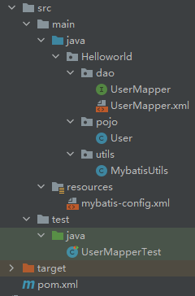

## 2.1-总体流程

1. 搭建环境
2. 导入Mybatis
3. 编写代码
4. 测试

## 2.2-搭建环境

### 2.2.1-搭建数据库环境

- 创建数据库

  ```mysql
  CREATE DATABASE `mybatis`;
  ```

- 进入数据库

  ```mysql
  USE `mybatis`;
  ```

- 创建表`user`

  ```mysql
  CREATE TABLE `user` (
    `id` int(20) NOT NULL,
    `name` varchar(30) DEFAULT NULL,
    `pwd` varchar(30) DEFAULT NULL,
    PRIMARY KEY (`id`)
  ) ENGINE=InnoDB DEFAULT CHARSET=utf8;
  ```

- 插入数据

  ```mysql
  INSERT   INTO `user` ( `id`, `name`, `pwd` )
  VALUES
  	( 1, 'ckj', 'ckj' ),
  	( 2, 'cdq', 'cdq' ),
  	( 3, 'jzh', 'jzh' );
  ```

### 2.2.2-项目环境处理

- 新建`maven`项目

- 删除`src`，使这个项目变成一个总项目

- 导入`maven`依赖

  - mabatis

    ```xml
    <!-- https://mvnrepository.com/artifact/org.mybatis/mybatis -->
    <dependency>
        <groupId>org.mybatis</groupId>
        <artifactId>mybatis</artifactId>
        <version>3.5.3</version>
    </dependency>
    ```

  - mysql

    ```xml
    <!-- https://mvnrepository.com/artifact/mysql/mysql-connector-java -->
    <dependency>
        <groupId>mysql</groupId>
        <artifactId>mysql-connector-java</artifactId>
        <version>8.0.23</version>
    </dependency>
    ```

  - junit

    ```xml
    <!-- https://mvnrepository.com/artifact/junit/junit -->
    <dependency>
        <groupId>junit</groupId>
        <artifactId>junit</artifactId>
        <version>4.13.2</version>
        <scope>test</scope>
    </dependency>
    ```
  
- 添加项目自动导入资源配置

  在`pom.xml`文件中，添加以下代码，以便程序自动将非`resource`目录下的`.properties`和`.xml`资源导入

  ```xml
  <build>
      <resources>
          <resource>
              <directory>src/main/resources</directory>
              <includes>
                  <include>**/*.properties</include>
                  <include>**/*.xml</include>
              </includes>
              <filtering>true</filtering>
          </resource>
          <resource>
              <directory>src/main/java</directory>
              <includes>
                  <include>**/*.properties</include>
                  <include>**/*.xml</include>
              </includes>
              <filtering>true</filtering>
          </resource>
      </resources>
  </build>
  ```

## 2.3-Helloworld

### 2.3.1-新建项目

在总项目下建立子项目`Mybatis-01-Helloworld`

### 2.3.2-xml配置文件

在`resources`文件夹下创建`mybatis-config.xml`文件

```xml
<?xml version="1.0" encoding="UTF-8" ?>
<!DOCTYPE configuration
        PUBLIC "-//mybatis.org//DTD Config 3.0//EN"
        "http://mybatis.org/dtd/mybatis-3-config.dtd">
<configuration>
    <environments default="development">
        <environment id="development">
            <transactionManager type="JDBC"/>
            <dataSource type="POOLED">
                <property name="driver" value="com.mysql.jdbc.Driver"/>
                <property name="url" value="jdbc:mysql://localhost:3306/mybatis?useSSL=true&amp;useUnicode=true&amp;characterEncoding=utf8"/>
                <property name="username" value="root"/>
                <property name="password" value="ckj"/>
            </dataSource>
        </environment>
    </environments>
</configuration>
```

> xml解释

每个`environment`都配置这一个数据库的`driver`、`url`、`username`、`password`，即数据库的基础环境

至此，完成`数据库配置`

### 2.3.3-MyBatis工具类

每个基于 MyBatis 的应用都是以一个 SqlSessionFactory 的实例为核心的。

SqlSessionFactory 的实例可以通过 SqlSessionFactoryBuilder 获得。

SqlSessionFactoryBuilder 则可以从 XML 配置文件或一个预先配置的 Configuration 实例来构建出 SqlSessionFactory 实例

> 步骤

1. 获取`sqlSessionFactory`对象
2. 从`sqlSessionFactory`中获取`SqlSession`实例

> 代码实现

1. 获取`sqlSessionFactory`对象

   ```java
   static{
       // 获取sqlSessionFactory对象
       try {
           String resource = "mybatis-config.xml";
           InputStream inputStream = Resources.getResourceAsStream(resource);
           SqlSessionFactory sqlSessionFactory = new SqlSessionFactoryBuilder().build(inputStream);
       } catch (IOException e) {
           e.printStackTrace();
       }
   }
   ```

2. 从`sqlSessionFactory`中获取`SqlSession`实例

   ```java
   public static SqlSession getSqlSession(){
       return sqlSessionFactory.openSession();
   }
   ```

> 工具类全部代码

```java
package Helloworld.utils;

import org.apache.ibatis.io.Resources;
import org.apache.ibatis.session.SqlSession;
import org.apache.ibatis.session.SqlSessionFactory;
import org.apache.ibatis.session.SqlSessionFactoryBuilder;
import java.io.IOException;
import java.io.InputStream;

public class MybatisUtils {
    private static SqlSessionFactory sqlSessionFactory;

    static{
        // 获取sqlSessionFactory对象
        try {
            String resource = "mybatis-config.xml";
            InputStream inputStream = Resources.getResourceAsStream(resource);
            sqlSessionFactory = new SqlSessionFactoryBuilder().build(inputStream);
        } catch (IOException e) {
            e.printStackTrace();
        }
    }
    // 获取SqlSession对象
    public static SqlSession getSqlSession(){
        return sqlSessionFactory.openSession();
    }

}
```

### 2.3.4-主体代码

- 实体类
- Dao接口（根据惯例，后续用Mapper表示，效果上等同于Dao）
- 接口实现类

> 代码结构



> 代码实现

- 实体类POJO.User

  ```java
  package Helloworld.pojo;
  
  public class User {
      private int id;
      private String name;
  
      private String pwd;
  
      // 含参构造
      // 无参构造
      // get && set
      // toString
  }
  ```

- 接口`UserMapper`（等同于Dao，但根据命名规范，应为Mapper）

  ```java
  package Helloworld.dao;
  
  import Helloworld.pojo.User;
  
  import java.util.List;
  
  public interface UserMapper {
      List<User> getUserList();
  }
  ```

- 接口实现类，`UserMapper.xml`配置文件

  ```xml
  <?xml version="1.0" encoding="UTF-8" ?>
  <!DOCTYPE mapper
          PUBLIC "-//mybatis.org//DTD Mapper 3.0//EN"
          "http://mybatis.org/dtd/mybatis-3-mapper.dtd">
  <mapper namespace="Helloworld.dao.UserMapper">
      <select id="getUserList" resultType="Helloworld.pojo.User">
          select * from user
      </select>
  </mapper>
  ```

- `MybatisUtils`

  [2.3.3-MyBatis工具类](#2.3.3-MyBatis工具类)

- `mybatis-config.xml`，添加注册

  ```xml
  <?xml version="1.0" encoding="UTF-8" ?>
  <!DOCTYPE configuration
          PUBLIC "-//mybatis.org//DTD Config 3.0//EN"
          "http://mybatis.org/dtd/mybatis-3-config.dtd">
  <configuration>
      <environments default="development">
          <environment id="development">
              <transactionManager type="JDBC"/>
              <dataSource type="POOLED">
                  <property name="driver" value="com.mysql.cj.jdbc.Driver"/>
                  <property name="url" value="jdbc:mysql://localhost:3306/mybatis?useSSL=false&amp;allowPublicKeyRetrieval=true&amp;useUnicode=true&amp;characterEncoding=UTF-8"/>
                  <property name="username" value="root"/>
                  <property name="password" value="ckj"/>
              </dataSource>
          </environment>
      </environments>
  
      <mappers>
          <mapper resource="Helloworld/dao/UserMapper.xml"></mapper>
      </mappers>
  </configuration>
  ```

- 测试

  ```java
  import Helloworld.dao.UserMapper;
  import Helloworld.pojo.User;
  import Helloworld.utils.MybatisUtils;
  import org.apache.ibatis.session.SqlSession;
  import org.junit.Test;
  
  import java.util.List;
  
  public class UserMapperTest {
  
      @Test
      public void test(){
          //第一步，获得SqlSession对象
          SqlSession sqlSession = MybatisUtils.getSqlSession();
          //方式一：
          // List<User> userList= sqlSession.selectList("Helloworld.dao.UserMapper.getUserList");
  
          //方法二：
          UserMapper mapper = sqlSession.getMapper(UserMapper.class);
          List<User> userList = mapper.getUserList();
          
          for(User user:userList){
              System.out.println(user);
          }
  
          //关闭sqlsession
          sqlSession.close();
      }
  }
  ```

> 代码分析

- 接口`UserMapper`

  相当于我们之前的`UserDao`，但`mybatis`中的命名规范为`Mapper`

- 接口实现类，`UserMapper.xml`配置文件

  相当于`UserMapper.xml`取代了`UserDaoImpl`的作用

  `mapper`标签中`namespace`属性，==命名空间==，绑定一个对应的`Mapper/Dao`接口，==包名+接口名==，在`Helloworld.pojo.User`命名空间中，定义了一个`getUserList`的映射语句，也可使用短命名（前提：短命名唯一），`User`

  `mapper`标签下有多个子标签，分别对应不同的数据库方法，在这类子标签中，执行的是数据库命令

  `mapper`子标签有以下主要属性

  - `id`绑定接口下的一个方法，==方法名==
  - `resultType`绑定返回类型（单个），==包路径+类名==
  - `resultMap`绑定返回集合（多个），==包路径+类名==
  - ……

- `MybatisUtils`，工具实现类

  每个基于 MyBatis 的应用都是以一个 `SqlSessionFactory` 的实例为核心的

  `MybatisUtils`用于生成`sqlSessionFactory`对象，再通过`sqlSessionFactory.openSession()`从`sqlSessionFactory`实例中获取`SqlSession`对象，实现方法封装。`SqlSession`提供了在数据库执行SQL命令所需的所有方法

  1. 获取`sqlSessionFactory`对象

     首先，加载数据库配置的xml资源，构建输入流`inputStream`实例

     ```java
     InputStream inputStream = Resources.getResourceAsStream(resource);
     ```

     再通过`SqlSessionFactoryBuilder().build(inputStream)`方法，运用输入流实例，建立`sqlSessionFactory`对象

  2. 获取`SqlSession`对象

     通过`sqlSessionFactory.openSession()`方法实现`SqlSession`对象的获取

- `mybatis-config.xml`

  该部分代码与[2.3.2-xml配置文件](#2.3.2-xml配置文件)的代码的区别，就是添加了对`Mapper-xml`资源的注册

  ```xml
  <mappers>
      <mapper resource="Helloworld/dao/UserMapper.xml"></mapper>
  </mappers>
  ```

  `resource`标签的内容为对应的自定义的接口实现类（包路径+xml文件），本文中为：`Helloworld/dao/UserMapper.xml`

  若没添加注册，则会报错：`MapperRegistry`找不到该接口实现类

  `org.apache.ibatis.binding.BindingException: Type interface Helloworld.dao.UserMapper is not known to the MapperRegistry.`

- `UserMapper.xml`

  > 两种方法

  1. 直接获取接口实现类中的方法

     通过`SqlSession.selectList()`方法

     其中的参数为接口实现类中的方法id（`包路径+接口实现类(不含xml)+id`，通过`.`的方式连接）

  2. 通过执行SQL语句

     获取接口实现类，通过接口实现类下定义的方法实现

  > 善后处理

  需要关闭`sqlsession`，避免内存泄漏