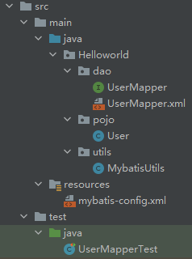

## 3.1-重要事项

### 3.1.1-namespace

namespace中的包名要和 Mapper 接口的包名一致

### 3.1.2-语句类型

- `id`：就是对应的namespace中的方法名
- `resuletType`：Sql语句执行的返回值
- `parameterType`：参数类型

### 3.1.3-提交事务

`增删改`需要提交事务

提交事务：`sqlSession.commit()`

### 3.1.4-sql语句获取参数

采用`#{}`方式利用参数，`{}`中输入传入参数中的变量名

## 3.2-代码

### 3.2.1-代码结构



### 3.2.2-代码详情

1. UserMapper

   ```java
   package Helloworld.dao;
   
   import Helloworld.pojo.User;
   
   import java.util.List;
   
   public interface UserMapper {
       //查询全部用户
       List<User> getUserList();
       //根据Id查询用户
       User getUserById(int id);
       //insert 一个用户
       int addUser(User user);
       //update
       int updateUser(User user);
       //delete
       int deleteUser(int id);
   }
   ```

2. UserMapper.xml

   ```java
   <?xml version="1.0" encoding="UTF-8" ?>
   <!DOCTYPE mapper
           PUBLIC "-//mybatis.org//DTD Mapper 3.0//EN"
           "http://mybatis.org/dtd/mybatis-3-mapper.dtd">
   <mapper namespace="Helloworld.dao.UserMapper">
       <select id="getUserList" resultType="Helloworld.pojo.User">
           select *
           from user;
       </select>
   
       <select id="getUserById" parameterType="int" resultType="Helloworld.pojo.User">
           select *
           from user
           where id = #{id};
       </select>
   
       <insert id="addUser" parameterType="Helloworld.pojo.User">
           insert into user (id, name, pwd) value (#{id},#{name},#{pwd});
       </insert>
   
       <update id="updateUser" parameterType="Helloworld.pojo.User">
           update user
           set name = #{name},
               pwd= #{pwd}
           where id = #{id};
       </update>
   
       <delete id="deleteUser" parameterType="int">
           delete
           from user
           where id = #{id};
       </delete>
   </mapper>
   ```

3. UserMapperTest

   ```java
   import Helloworld.dao.UserMapper;
   import Helloworld.pojo.User;
   import Helloworld.utils.MybatisUtils;
   import org.apache.ibatis.session.SqlSession;
   import org.junit.Test;
   
   import java.util.List;
   
   public class UserMapperTest {
   
       @Test
       public void test() {
           //第一步，获得SqlSession对象
           SqlSession sqlSession = MybatisUtils.getSqlSession();
           //方式一：
           // List<User> userList= sqlSession.selectList("Helloworld.dao.UserMapper.getUserList");
   
           //方法二：
           UserMapper mapper = sqlSession.getMapper(UserMapper.class);
           List<User> userList = mapper.getUserList();
   
           for (User user : userList) {
               System.out.println(user);
           }
   
           //关闭sqlsession
           sqlSession.close();
       }
   
       @Test
       public void getUserByIdTest() {
           SqlSession sqlSession = MybatisUtils.getSqlSession();
           UserMapper mapper = sqlSession.getMapper(UserMapper.class);
           User user = mapper.getUserById(1);
           System.out.println(user);
   
           sqlSession.close();
       }
   
       @Test
       public void UseraddTest() {
           SqlSession sqlSession = MybatisUtils.getSqlSession();
           UserMapper mapper = sqlSession.getMapper(UserMapper.class);
           int result = mapper.addUser(new User(4, "wjy", "wjy"));
   
           System.out.println(result);
           sqlSession.commit();
           //提交事务
           sqlSession.close();
       }
   
       @Test
       public void updateUser() {
           SqlSession sqlSession = MybatisUtils.getSqlSession();
   
           UserMapper mapper = sqlSession.getMapper(UserMapper.class);
           int result = mapper.updateUser(new User(4, "更改后name", "更改后pwd"));
           System.out.println(result);
           sqlSession.commit();
           sqlSession.close();
       }
   
       @Test
       public void deleteUserTest() {
           SqlSession sqlSession = MybatisUtils.getSqlSession();
           UserMapper mapper = sqlSession.getMapper(UserMapper.class);
   
           int result = mapper.deleteUser(4);
           System.out.println(result);
   
           sqlSession.commit();
           sqlSession.close();
       }
   }
   ```

4. 其余代码

   其余代码与 [2-HelloWorld.md](2-HelloWorld.md) 中的代码相同

### 3.2.3-代码分析

1. UserMapper

   设定`Mapper`接口

2. UserMapper.xml

   接口实现类

   > `mapper`标签中属性：`namespace`

   ==命名空间==，绑定一个对应的`Mapper/Dao`接口，==包名+接口名==，在`Helloworld.pojo.User`命名空间中，定义了一个`getUserList`的映射语句，也可使用短命名（前提：短命名唯一），`User`

   > `mapper`标签下有多个子标签，分别对应不同的数据库方法，在这类子标签中，执行的是数据库命令

   `mapper`子标签有以下主要属性

   - `id`绑定接口下的一个方法，==方法名==
   - `resultType`绑定返回类型（单个），==包路径+类名==
   - `resultMap`绑定返回集合（多个），==包路径+类名==……

3. UserMapperTest

   第一步，获得SqlSession对象

   第二步，使用和指定语句的参数和返回值相匹配的接口（`Mapper接口.class`），获取`Mapper`实例

   第三步，通过`Mapper`实例，执行设定好的`Sql`语句

   第四步，提交事务（查询语句不需要提交）

   第五步，关闭`sqlSession`

### 3.2.4-实现步骤

1. 编写接口
2. 实现接口，sql
3. 编写测试

## 3.3-分析错误

mybatis-config.xml

`mapper`中的`resource`，需要用`/`分割，不能用`.`

## 3.4-万能Map

前提思考：如果User中有很多字段，会导致sql语句中需要写很多字段，会导致编写非常麻烦

如果，需要传入多个参数，而不是一个User或一个Map，可以考虑利用`Map`来实现sql语句

此时，可考虑利用`Map`来实现sql语句

### 3.4.1-代码结构


### 3.4.2-代码变化

1. UserMapper

   ```java
   //万能Map
   int addUser2(Map<String,Object> map);
   ```

2. UserMapper.xml

   ```xml
   <insert id="addUser2" parameterType="map">
       insert into user (id, name, pwd) value (#{userId},#{userName},#{userPwd});
   </insert>
   ```

3. UserMapperTest

   ```java
   @Test
   public void UseraddTest2() {
       SqlSession sqlSession = MybatisUtils.getSqlSession();
       UserMapper mapper = sqlSession.getMapper(UserMapper.class);
   
       Map<String,Object> map = new HashMap<String,Object>();
       map.put("userId",4);
       map.put("userName","userName");
       map.put("userPwd","userPwd");
       mapper.addUser2(map);
   
       sqlSession.commit();
       //提交事务
       sqlSession.close();
   }
   ```

## 3.5-模糊查询

添加代码：

```java
//UserMapper
List<User> getUserLike(String value);

//UserMapper.xml
<select id="getUserLike" resultType="Helloworld.pojo.User">
	select * from user where name like #{value}
</select>

//UserMapperTest
@Test
public void getUserByLikeTest() {
    //第一步，获得SqlSession对象
    SqlSession sqlSession = MybatisUtils.getSqlSession();

    UserMapper mapper = sqlSession.getMapper(UserMapper.class);
    String value = "%jz%";
    List<User> userList = mapper.getUserLike(value);

    for (User user : userList) {
        System.out.println(user);
    }

    //关闭sqlsession
    sqlSession.close();
}
```

