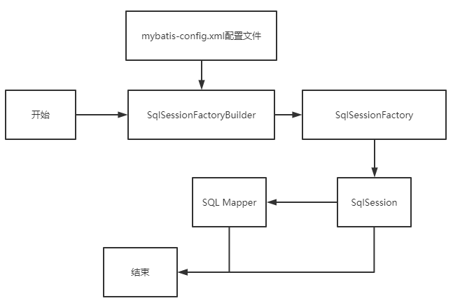
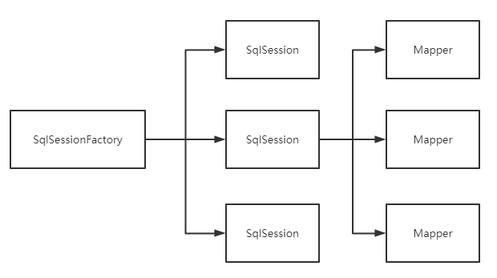
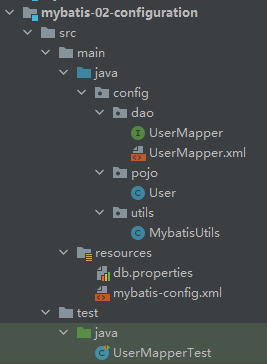
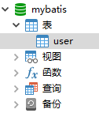
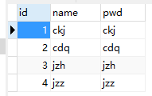

## 1-核心配置文件

- mybatis-config.xml

- MyBatis 的配置文件`configuration`包含了会深深影响 MyBatis 行为的设置和属性信息

  ```xml
  properties（属性）
  settings（设置）
  typeAliases（类型别名）
  typeHandlers（类型处理器）
  objectFactory（对象工厂）
  plugins（插件）
  environments（环境配置）
  	environment（环境变量）
  		transactionManager（事务管理器）
  		dataSource（数据源）
  databaseIdProvider（数据库厂商标识）
  mappers（映射器）
  ```

## 2-环境配置

### 2.1-`environments`元素定义配置环境

`MyBatis`可以配置成适应多种环境

尽管可以配置多个环境，但每个 SqlSessionFactory 实例只能选择一种环境，通过`environments`标签中的`default`去选择其下的`environment`的`id`

如：选择`id`为`test`的`environment`

```xml
<environments default="test">
    <environment id="development">
        <transactionManager type=""/>
        <dataSource type="">
            <property name="" value=""/>
            <property name="" value=""/>
            <property name="" value=""/>
            <property name="" value=""/>
        </dataSource>
    </environment>
    <environment id="test">
        <transactionManager type=""></transactionManager>
        <dataSource type="">
            <property name="" value=""/>
            <property name="" value=""/>
            <property name="" value=""/>
            <property name="" value=""/>
        </dataSource>
    </environment>
</environments>
```

- 默认使用的环境`ID`（比如：`default="development"`）
- 每个`environment`元素定义的环境`ID`（比如：`id="development"`）
- 事务管理器的配置（比如：`type="JDBC"`）
- 数据源的配置（比如：`type="POOLED"`）

### 2.2-事务管理器`transactionManager`

`MyBatis`中有两种类型的事务管理器

1. JDBC

   ==默认==

   直接使用JDBC的提交和回滚机制，它依赖从数据源获得的连接来管理事务作用域

2. MANAGED

   几乎没做什么，不提交回滚一个连接，而是让容器来管理事务的整个生命周期。默认情况下会关闭连接。然而一些容器并不希望连接被关闭，因此需要将`closeConnection`属性设置为`false`来阻止默认的关闭行为

   ```xml
   <transactionManager type="MANAGED">
     <property name="closeConnection" value="false"/>
   </transactionManager>
   ```

如果使用`Spring` + `MyBatis`，就没有必要配置事务管理器

### 2.3-数据源`dataSource`

`dataSource`元素使用标准的`JDBC`数据源接口来配置`JDBC`连接对象的资源。

有三种内建的数据源类型（也就是 `type="[UNPOOLED|POOLED|JNDI]`"）：

type：

1. `UNPOOLED`
2. `POOLED`
3. `JNDI`

#### UNPOOLED

每次请求时打开和关闭连接，仅需要配置以下属性

- `driver`

  这是 JDBC 驱动的 Java 类全限定名（并不是 JDBC 驱动中可能包含的数据源类）

- `url`

  这是数据库的 JDBC URL 地址。

- `username`

  登录数据库的用户名。

- `password`

  登录数据库的密码。

- `defaultTransactionIsolationLevel`

  默认的连接事务隔离级别。

- `defaultNetworkTimeout`

  等待数据库操作完成的默认网络超时时间（单位：毫秒）。可以查看`java.sql.Connection#setNetworkTimeout()` 的 API 文档以获取更多信息。

作为可选项，可以传递属性给数据库驱动。只需在属性名加上“driver.”前缀即可，例如：

- `driver.encoding=UTF8`

  这将通过`DriverManager.getConnection(url, driverProperties)`方法传递值为`UTF8`的`encoding`属性给数据库驱动

#### POOLED

连接池

```xml
<environments default="test">
    <environment id="development">
        <transactionManager type="JDBC"/>
        <dataSource type="POOLED">
            <property name="driver" value="com.mysql.cj.jdbc.Driver"/>
            <property name="url" value="jdbc:mysql://localhost:3306/mybatis?useSSL=false&amp;allowPublicKeyRetrieval=true&amp;useUnicode=true&amp;characterEncoding=UTF-8"/>
            <property name="username" value="root"/>
            <property name="password" value="ckj"/>
        </dataSource>
    </environment>
    <environment id="test">
        <transactionManager type="JDBC"></transactionManager>
        <dataSource type="POOLED">
            <property name="driver" value="com.mysql.cj.jdbc.Driver"/>
            <property name="url" value="jdbc:mysql://localhost:3306/mybatis?useSSL=false&amp;allowPublicKeyRetrieval=true&amp;useUnicode=true&amp;characterEncoding=UTF-8"/>
            <property name="username" value="root"/>
            <property name="password" value="ckj"/>
        </dataSource>
    </environment>
</environments>
```

## 3-属性.properties

可通过properties属性，来实现引入配置文件

这些属性可以在外部进行配置，并可以进行动态替换。既可以在典型的 Java 属性文件中配置这些属性，也可以在 properties 元素的子元素中设置。

从而，在`dataSource`标签下，`property`属性可以动态关联

> db.properties

注意：此处的配置链接仅为`&`，不是`&amp;`

```properties
driver=com.mysql.cj.jdbc.Driver
url=jdbc:mysql://localhost:3306/mybatis?useSSL=false&allowPublicKeyRetrieval=true&useUnicode=true&characterEncoding=UTF-8
username=root
password=ckj
```

> 在核心文件`mybatis-config.xml`中引入

前提知识：在xml中，所有的标签都可以规定其顺序，在`xml`中，`properties`必须写在`<configuration>`标签下的第一行

并且，在该`properties`标签下，可以通过子标签`property`==新建==属性，若属性名与外部引用属性重复，则以外部为准（即外部优先）

读取顺序：先读取`properties`内部子标签的属性，再读取外部引入的属性，若冲突，则外部进行覆盖

```xml
<!--引入外部配置文件-->
<properties resource="db.properties"></properties>
```

> 从而，`mybatis-config.xml`文件代码变为：

```xml
<?xml version="1.0" encoding="UTF-8" ?>
<!DOCTYPE configuration
        PUBLIC "-//mybatis.org//DTD Config 3.0//EN"
        "http://mybatis.org/dtd/mybatis-3-config.dtd">
<configuration>
    <!--引入外部配置文件-->
    <properties resource="db.properties"></properties>

    <environments default="development">
        <environment id="development">
            <transactionManager type="JDBC"/>
            <dataSource type="POOLED">
                <property name="driver" value="${driver}"/>
                <property name="url" value="${url}"/>
                <property name="username" value="${username}"/>
                <property name="password" value="${password}"/>
            </dataSource>
        </environment>
    </environments>

    <mappers>
        <mapper resource="config/dao/UserMapper.xml"></mapper>
    </mappers>
</configuration>
```

## 4-类型别名

为`Java类型`设置一个`缩写名字`

### 4.1-单个类型

在`mybatis-config.xml`中加入以下内容（位置在`properties`之后）

```xml
<typeAliases>
    <typeAlias type="config.pojo.User" alias="Haha"></typeAlias>
</typeAliases>
```

> `mybatis-config.xml`

```xml
<?xml version="1.0" encoding="UTF-8" ?>
<!DOCTYPE configuration
        PUBLIC "-//mybatis.org//DTD Config 3.0//EN"
        "http://mybatis.org/dtd/mybatis-3-config.dtd">
<configuration>
    <properties resource="db.properties"></properties>
    <typeAliases>
        <typeAlias type="config.pojo.User" alias="Haha"></typeAlias>
    </typeAliases>
    <environments default="development">
        <environment id="development">
            <transactionManager type="JDBC"/>
            <dataSource type="POOLED">
                <property name="driver" value="${driver}"/>
                <property name="url" value="${url}"/>
                <property name="username" value="${username}"/>
                <property name="password" value="${password}"/>
            </dataSource>
        </environment>
    </environments>

    <mappers>
        <mapper resource="config/dao/UserMapper.xml"></mapper>
    </mappers>
</configuration>
```

> Mapper.xml

```xml
<select id="getUserList" resultType="Haha">
    select *
    from user;
</select>
```

### 4.2-多个类型

运用`packge`标签，其中`name`属性的值为包名，则会自动扫描其下的类型，在运用时，直接用类型名（可大写可小写），不需要加上包名，即不需要全路径

```xml
<typeAliases>
    <package name="config.pojo"/>
</typeAliases>
```

> Mapper.xml

```xml
<select id="getUserList" resultType="User">
    select *
    from user;
</select>
```

## 5-设置.setting

| 设置名                           | 描述                                                         | 有效值                                                       | 默认值                                                |
| :------------------------------- | :----------------------------------------------------------- | :----------------------------------------------------------- | :---------------------------------------------------- |
| cacheEnabled                     | 全局性地开启或关闭所有映射器配置文件中已配置的任何缓存。     | true \| false                                                | true                                                  |
| lazyLoadingEnabled               | 延迟加载的全局开关。当开启时，所有关联对象都会延迟加载。 特定关联关系中可通过设置 `fetchType` 属性来覆盖该项的开关状态。 | true \| false                                                | false                                                 |
| aggressiveLazyLoading            | 开启时，任一方法的调用都会加载该对象的所有延迟加载属性。 否则，每个延迟加载属性会按需加载（参考 `lazyLoadTriggerMethods`)。 | true \| false                                                | false （在 3.4.1 及之前的版本中默认为 true）          |
| multipleResultSetsEnabled        | 是否允许单个语句返回多结果集（需要数据库驱动支持）。         | true \| false                                                | true                                                  |
| useColumnLabel                   | 使用列标签代替列名。实际表现依赖于数据库驱动，具体可参考数据库驱动的相关文档，或通过对比测试来观察。 | true \| false                                                | true                                                  |
| useGeneratedKeys                 | 允许 JDBC 支持自动生成主键，需要数据库驱动支持。如果设置为 true，将强制使用自动生成主键。尽管一些数据库驱动不支持此特性，但仍可正常工作（如 Derby）。 | true \| false                                                | False                                                 |
| autoMappingBehavior              | 指定 MyBatis 应如何自动映射列到字段或属性。 NONE 表示关闭自动映射；PARTIAL 只会自动映射没有定义嵌套结果映射的字段。 FULL 会自动映射任何复杂的结果集（无论是否嵌套）。 | NONE, PARTIAL, FULL                                          | PARTIAL                                               |
| autoMappingUnknownColumnBehavior | 指定发现自动映射目标未知列（或未知属性类型）的行为。`NONE`: 不做任何反应`WARNING`: 输出警告日志（`'org.apache.ibatis.session.AutoMappingUnknownColumnBehavior'` 的日志等级必须设置为 `WARN`）`FAILING`: 映射失败 (抛出 `SqlSessionException`) | NONE, WARNING, FAILING                                       | NONE                                                  |
| defaultExecutorType              | 配置默认的执行器。SIMPLE 就是普通的执行器；REUSE 执行器会重用预处理语句（PreparedStatement）； BATCH 执行器不仅重用语句还会执行批量更新。 | SIMPLE REUSE BATCH                                           | SIMPLE                                                |
| defaultStatementTimeout          | 设置超时时间，它决定数据库驱动等待数据库响应的秒数。         | 任意正整数                                                   | 未设置 (null)                                         |
| defaultFetchSize                 | 为驱动的结果集获取数量（fetchSize）设置一个建议值。此参数只可以在查询设置中被覆盖。 | 任意正整数                                                   | 未设置 (null)                                         |
| defaultResultSetType             | 指定语句默认的滚动策略。（新增于 3.5.2）                     | FORWARD_ONLY \| SCROLL_SENSITIVE \| SCROLL_INSENSITIVE \| DEFAULT（等同于未设置） | 未设置 (null)                                         |
| safeRowBoundsEnabled             | 是否允许在嵌套语句中使用分页（RowBounds）。如果允许使用则设置为 false。 | true \| false                                                | False                                                 |
| safeResultHandlerEnabled         | 是否允许在嵌套语句中使用结果处理器（ResultHandler）。如果允许使用则设置为 false。 | true \| false                                                | True                                                  |
| mapUnderscoreToCamelCase         | 是否开启驼峰命名自动映射，即从经典数据库列名 A_COLUMN 映射到经典 Java 属性名 aColumn。 | true \| false                                                | False                                                 |
| localCacheScope                  | MyBatis 利用本地缓存机制（Local Cache）防止循环引用和加速重复的嵌套查询。 默认值为 SESSION，会缓存一个会话中执行的所有查询。 若设置值为 STATEMENT，本地缓存将仅用于执行语句，对相同 SqlSession 的不同查询将不会进行缓存。 | SESSION \| STATEMENT                                         | SESSION                                               |
| jdbcTypeForNull                  | 当没有为参数指定特定的 JDBC 类型时，空值的默认 JDBC 类型。 某些数据库驱动需要指定列的 JDBC 类型，多数情况直接用一般类型即可，比如 NULL、VARCHAR 或 OTHER。 | JdbcType 常量，常用值：NULL、VARCHAR 或 OTHER。              | OTHER                                                 |
| lazyLoadTriggerMethods           | 指定对象的哪些方法触发一次延迟加载。                         | 用逗号分隔的方法列表。                                       | equals,clone,hashCode,toString                        |
| defaultScriptingLanguage         | 指定动态 SQL 生成使用的默认脚本语言。                        | 一个类型别名或全限定类名。                                   | org.apache.ibatis.scripting.xmltags.XMLLanguageDriver |
| defaultEnumTypeHandler           | 指定 Enum 使用的默认 `TypeHandler` 。（新增于 3.4.5）        | 一个类型别名或全限定类名。                                   | org.apache.ibatis.type.EnumTypeHandler                |
| callSettersOnNulls               | 指定当结果集中值为 null 的时候是否调用映射对象的 setter（map 对象时为 put）方法，这在依赖于 Map.keySet() 或 null 值进行初始化时比较有用。注意基本类型（int、boolean 等）是不能设置成 null 的。 | true \| false                                                | false                                                 |
| returnInstanceForEmptyRow        | 当返回行的所有列都是空时，MyBatis默认返回 `null`。 当开启这个设置时，MyBatis会返回一个空实例。 请注意，它也适用于嵌套的结果集（如集合或关联）。（新增于 3.4.2） | true \| false                                                | false                                                 |
| logPrefix                        | 指定 MyBatis 增加到日志名称的前缀。                          | 任何字符串                                                   | 未设置                                                |
| logImpl                          | 指定 MyBatis 所用日志的具体实现，未指定时将自动查找。        | SLF4J \| LOG4J \| LOG4J2 \| JDK_LOGGING \| COMMONS_LOGGING \| STDOUT_LOGGING \| NO_LOGGING | 未设置                                                |
| proxyFactory                     | 指定 Mybatis 创建可延迟加载对象所用到的代理工具。            | CGLIB \| JAVASSIST                                           | JAVASSIST （MyBatis 3.3 以上）                        |
| vfsImpl                          | 指定 VFS 的实现                                              | 自定义 VFS 的实现的类全限定名，以逗号分隔。                  | 未设置                                                |
| useActualParamName               | 允许使用方法签名中的名称作为语句参数名称。 为了使用该特性，你的项目必须采用 Java 8 编译，并且加上 `-parameters` 选项。（新增于 3.4.1） | true \| false                                                | true                                                  |
| configurationFactory             | 指定一个提供 `Configuration` 实例的类。 这个被返回的 Configuration 实例用来加载被反序列化对象的延迟加载属性值。 这个类必须包含一个签名为`static Configuration getConfiguration()` 的方法。（新增于 3.2.3） | 一个类型别名或完全限定类名。                                 | 未设置                                                |
| shrinkWhitespacesInSql           | 从SQL中删除多余的空格字符。请注意，这也会影响SQL中的文字字符串。 (新增于 3.5.5) | true \| false                                                | false                                                 |
| defaultSqlProviderType           | Specifies an sql provider class that holds provider method (Since 3.5.6). This class apply to the `type`(or `value`) attribute on sql provider annotation(e.g. `@SelectProvider`), when these attribute was omitted. | A type alias or fully qualified class name                   | Not set                                               |

## 6-其他配置

- typerHandlers
- objectFactory
- plugins

## 7-映射器

MapperRgistry：注册绑定我们的Mapper文件

映射方式

1. 相对于类路径的资源引用

   `mybatis-config.xml`

   ```xml
   <mappers>
       <mapper resource="config/dao/UserMapper.xml"></mapper>
   </mappers>
   ```

2. 完全限定资源定位符（URL）——不使用

3. 使用映射器接口实现类的完全限定类名

   使用class文件方式绑定

   ```xml
   <mappers>
       <mapper class="config.dao.UserMapper"></mapper>
   </mappers>
   ```

   - 接口和Mapper配置文件==必须同名==
   - 接口和Mapper配置文件==必须在同一个包下==（可在生成后的代码文件中查看，如`idea`的`target`）

4. 讲包内的映射器接口实现全部注册为映射器

## 8-生命周期和作用域



生命周期，作用域，是至关重要的，使用错误会导致非常严重的==并发问题==

### 8.1-SqlSessionFactoryBuilder

- 一旦创建了SqlSessionFactory，就不需要它了
- 局部变量

### 8.2-SqlSessionFactory

- 可以想象成，数据库连接池
- `SqlSessionFactory`一旦被创建就应该在应用的运行期间一直存在，没有任何理由丢弃它或重新创建另一个实例
- 多次重建`SqlSessionFactory`被视为一种代码“坏习惯”
- 因此`SqlSessionFactory`的最佳作用域是应用作用域——一个`Application`
- 最简单的就是`使用单例模式`或者`静态单例模式`

### 8.3-SqlSession

- 连接到连接池的一个请求
- SqlSession的实例不是线程安全的，因此不能被共享，所以它的最佳的作用域是请求或方法作用域
- 用完之后需要赶紧关闭，否则资源被占用
- 不能讲SqlSession实例的引用放在任何类型的托管作用域中，比如Servlet框架中的HttpSession



每一个Mapper，就对应一张表，代表一个具体的业务


## 9-最终代码

> 代码结构



> 代码内容

- UserMapper.java

  ```java
  package config.dao;
  
  import config.pojo.User;
  
  import java.util.List;
  
  public interface UserMapper {
      //查询全部用户
      List<User> getUserList();
      //根据Id查询用户
      User getUserById(int id);
      //insert 一个用户
      int addUser(User user);
      //update
      int updateUser(User user);
      //delete
      int deleteUser(int id);
  }
  ```

- UserMapper.xml

  ```xml
  <?xml version="1.0" encoding="UTF-8" ?>
  <!DOCTYPE mapper
          PUBLIC "-//mybatis.org//DTD Mapper 3.0//EN"
          "http://mybatis.org/dtd/mybatis-3-mapper.dtd">
  <mapper namespace="config.dao.UserMapper">
      <select id="getUserList" resultType="config.pojo.User">
          select *
          from user;
      </select>
  
      <select id="getUserById" parameterType="int" resultType="config.pojo.User">
          select *
          from user
          where id = #{id};
      </select>
  
      <insert id="addUser" parameterType="config.pojo.User">
          insert into user (id, name, pwd) value (#{id},#{name},#{pwd});
      </insert>
  
      <update id="updateUser" parameterType="config.pojo.User">
          update user
          set name = #{name},
              pwd= #{pwd}
          where id = #{id};
      </update>
  
      <delete id="deleteUser" parameterType="int">
          delete
          from user
          where id = #{id};
      </delete>
  </mapper>
  ```

- User.java

  ```java
  package config.pojo;
  
  public class User {
      private int id;
      private String name;
  
      private String pwd;
  
      public User() {
      }
  
      public User(int id, String name, String pwd) {
          this.id = id;
          this.name = name;
          this.pwd = pwd;
      }
  
      public int getId() {
          return id;
      }
  
      public void setId(int id) {
          this.id = id;
      }
  
      public String getName() {
          return name;
      }
  
      public void setName(String name) {
          this.name = name;
      }
  
      public String getPwd() {
          return pwd;
      }
  
      public void setPwd(String pwd) {
          this.pwd = pwd;
      }
  
      @Override
      public String toString() {
          return "User{" +
                  "id=" + id +
                  ", name='" + name + '\'' +
                  ", pwd='" + pwd + '\'' +
                  '}';
      }
  }
  ```

- MyabatisUtils

  ```java
  package config.utils;
  
  import org.apache.ibatis.io.Resources;
  import org.apache.ibatis.session.SqlSession;
  import org.apache.ibatis.session.SqlSessionFactory;
  import org.apache.ibatis.session.SqlSessionFactoryBuilder;
  
  import java.io.IOException;
  import java.io.InputStream;
  
  public class MybatisUtils {
      private static SqlSessionFactory sqlSessionFactory;
  
      static {
          try {
              String resource = "mybatis-config.xml";
              InputStream inputStream = Resources.getResourceAsStream(resource);
              sqlSessionFactory = new SqlSessionFactoryBuilder().build(inputStream);
          } catch (IOException e) {
              e.printStackTrace();
          }
      }
  
      public static SqlSession getSqlSession(){
          return sqlSessionFactory.openSession();
      }
  }
  ```

- db.properties

  ```properties
  driver=com.mysql.cj.jdbc.Driver
  url=jdbc:mysql://localhost:3306/mybatis?useSSL=false&allowPublicKeyRetrieval=true&useUnicode=true&characterEncoding=UTF-8
  username=root
  password=ckj
  ```

- mybatis-config.xml

  ```xml
  <?xml version="1.0" encoding="UTF-8" ?>
  <!DOCTYPE configuration
          PUBLIC "-//mybatis.org//DTD Config 3.0//EN"
          "http://mybatis.org/dtd/mybatis-3-config.dtd">
  <configuration>
      <properties resource="db.properties"></properties>
      <environments default="development">
          <environment id="development">
              <transactionManager type="JDBC"/>
              <dataSource type="POOLED">
                  <property name="driver" value="${driver}"/>
                  <property name="url" value="${url}"/>
                  <property name="username" value="${username}"/>
                  <property name="password" value="${password}"/>
              </dataSource>
          </environment>
      </environments>
  
      <mappers>
          <mapper resource="config/dao/UserMapper.xml"></mapper>
      </mappers>
  </configuration>
  ```

> 数据库结构

数据库名：`mybatis`

表名：`user`



字段及内容



