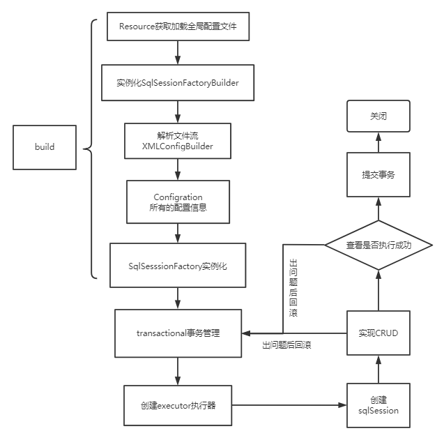
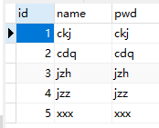
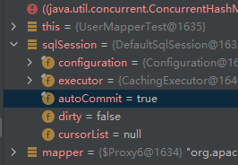

## 1-面向接口编程

### 1.1-原因：

- 解耦
- 可拓展，提高复用
- 分层开发中，上层不用管具体的实现
- 大家遵守共同的标准，使得开发变得容易，规范性更好

### 1.2-关于接口的理解

- 接口从更深层次的理解，应是定义（规范，约束）与实现（名实分离的原则）的分离。
- 接口的本身反映了系统设计人员对系统的抽象理解。
- 接口应有两类：第一类是对一个个体的抽象，它可对应为一个抽象体(abstract class)；
- 第二类是对一个个体某一方面的抽象，即形成一个抽象面（interface）；
- 一个体有可能有多个抽象面。
- 抽象体与抽象面是有区别的。

## 2-注解开发

### 2.1-实现步骤

1. 注解在接口上实现

   ```java
   @Select("select * from user")
   List<User> getUser();
   ```

2. 在核心配置文件中绑定接口

   ```xml
   <mappers>
       <mapper class="config.dao.UserMapper"></mapper>
   </mappers>
   ```

3. 测试

### 2.2-理解

本质：反射机制实现

底层：动态代理，可通过该文章理解 [10-代理模式.md](..\Spring\学习\10-代理模式.md) 

#### Mybatis详细的执行流程



## 3-CRUD

将`MybatisUtils.java`的部分代码改为

```java
public static SqlSession getSqlSession(){
    return sqlSessionFactory.openSession(true);
}
```

附带一个参数`true`，将使得`sqlSession`默认自动提交事务，即`增删改`的时候不需要再进行提交事务

### 3.1-增

接口代码

```java
@Insert("insert into user(id,name,pwd) value (#{id},#{name},#{password})")
int addUser(User user);
```

测试代码

```java
public class UserMapperTest {
    @Test
    public void test() {
        SqlSession sqlSession = MybatisUtils.getSqlSession();
        UserMapper mapper = sqlSession.getMapper(UserMapper.class););

        mapper.addUser(new User(5,"xxx","xxx"));

        sqlSession.close();
    }
}

```

由于已经默认提交事务了，所以不需要在进行提交事务

结果显示，成功插入数据



进行`debug`，


会发现，在`sqlSession`中，`autoCommit`属性变为`true`



### 3.2-查

接口代码为

```java
// 方法存在多个参数，所有参数前面必须加上@Param注解
@Select("select * from user where id = #{uid}")
User getUserById(@Param("uid") int id);
```

其中`@Param`所跟的值，对应上方`SQL`代码中的变量即`#{uid}`

### 3.3-改

```java
@Update("update user set name=#{name},pwd=#{password} where id = #{id}")
int updateUser(User user);
```

### 3.4-删

```java
@Delete("delete from user where id = #{uid}")
int deleteUser(@Param("uid") int id);
```

### 3.5-关于`@Param()`注解

- 基本类型的参数或`String`类型，需要加上
- 引用类型不需要加
- 如果只有一个基本类型的话，可以忽略，但建议加上
- 在`SQL`中引用的就是`@Param()`中设定的属性名

### `#{}`和`${}`的区别

- 一般用`#`注解，用来传入参数，sql在解析的时候会加上`""`，当成字符串来解析
- `#{}`能够很大程度上防止`sql`注入
- `${}`传入数据直接显示在生成的sql中，直接拼接，`${}`无法防止`sql`注入

